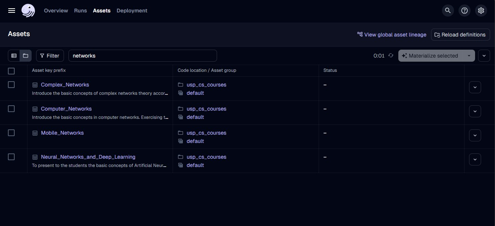
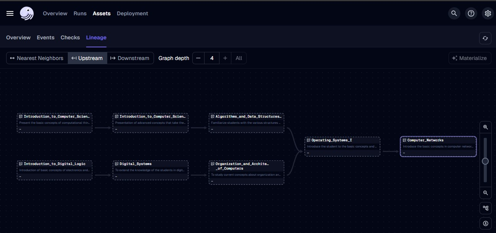
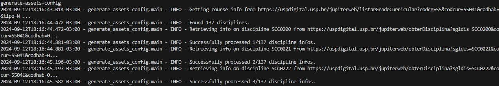

# USP Computer Science Catalog

The goal of this project is to get the latest curriculum info on the [Computer Science course from USP São Carlos course](https://uspdigital.usp.br/jupiterweb/listarGradeCurricular?codcg=55&codcur=55041&codhab=0&tipo=N) and leverage the Dagster UI to get an optimal learning path based on data lineage.

## Context

I was looking forward to build a strong foundation on CS Fundamentals, so I decided to take the USP São Carlos Computer Science Course curriculum as a guideline. But then, the following question arises: how can I find the optimal learning path for a specific subject (say, Computer Networks)?

The original info was presented in a form that is not user-friendly to identify the dependencies between subjects, and so the idea of defining them as [Dagster External Assets](https://docs.dagster.io/concepts/assets/external-assets) and using the lineage info to provide a learning path seemed appealing.

## Usage

1. Run `make`.

1. Access the Dagster UI on `localhost:3000`, then go to `Assets` and filter for a specific subject (e.g. "Redes de Computadores"):

1. After selecting your asset, go to `Lineage` and select `Upstream` and `Graph depth = All`. And there you have it: the shortest learning path towards the desired subject!

## Refreshing Information

1. In a separate terminal, run `generate-assets-config`. You should see log output like the following:
You should see output like the following:

1. Click `Reload Definitions` in the Dagster UI.
